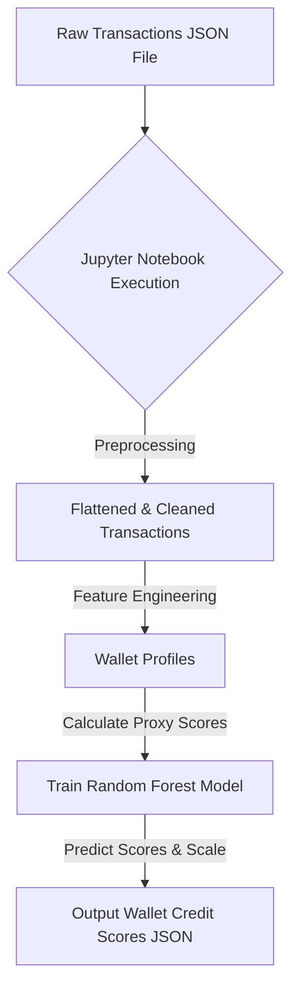

# Credit_scoring

This repository contains a robust machine learning model designed to assign a credit score (0-1000) to wallets interacting with the Aave V2 protocol, based solely on their historical on-chain transaction behavior. Higher scores indicate reliable and responsible usage and lower scores reflect risky, bot-like, or exploitative behavior.

## Table of Contents

1.  [Problem Statement](#1-problem-statement)
2.  [Methodology](#2-methodology)
    * [Data Source](#data-source)
    * [Feature Engineering](#feature-engineering)
    * [Proxy Credit Score Logic](#proxy-credit-score-logic)
    * [Model Choice](#model-choice)
    * [Model Performance](#model-performance)
3.  [Architecture & Processing Flow](#3-architecture--processing-flow)
4.  [How to Use (Jupyter Notebook)](#4-how-to-use-jupyter-notebook)
5.  [Deliverables](#5-deliverables)

## 1. Problem Statement

Decentralized Finance (DeFi) protocols like Aave lack traditional credit scoring mechanisms, making it challenging to assess the trustworthiness and risk profile of participants. Evaluating a wallet's reliability based purely on its on-chain interactions is essential for various applications:

1. Enabling undercollateralized lending.
2. Implementing reputation systems.
3. Identifying potential bad actors or bot-like behavior.
4. Enhancing overall protocol risk management.

This project addresses this by developing an ML model to generate a transparent and explainable credit score from raw transaction data.

## 2. Methodology

### Data Source

The model is trained and validated using a sample of **100,000 raw, transaction-level data points** from the Aave V2 protocol. Each record typically includes: `wallet` (or `userWallet`), `action` (e.g., `deposit`, `borrow`, `repay`, `redeemunderlying`, `liquidationcall`), `asset`, `amount` (often nested), `assetPriceUSD`, and `timestamp`.

### Feature Engineering

The raw transaction data, initially 100,000 rows (individual transactions), was transformed into **approximately 4,000 unique wallet profiles**. This crucial step involved:

1.  **Preprocessing Raw Data:**
    * Flattening nested JSON structures (specifically `actionData`) to expose fields like `amount` and `assetSymbol` directly.
    * Standardizing `amount` (from `actionData.amount`) and `asset` (from `actionData.assetSymbol`) columns.
    * Converting `timestamp` to datetime objects and numerical `amount` and `assetPriceUSD` to numeric types.
    * Creating a unified `amount_usd` column by multiplying `amount` by `assetPriceUSD` for cross-asset comparability.
    * Dropping irrelevant internal IDs and redundant columns.

2.  **Aggregating to Wallet-Level Features:** For each unique wallet, over 20 summary features were engineered, providing a comprehensive behavioral profile. These capture:
    * **Activity & Engagement:** Total transactions, days active, transaction frequency, unique assets interacted with.
    * **Deposit/Supply Behavior:** Total and average amount deposited (USD), number of deposits, largest single deposit, deposit volatility.
    * **Borrow Behavior:** Total and average amount borrowed (USD), number of borrows, largest single borrow, borrow volatility.
    * **Repayment Behavior:** Total and average amount repaid (USD), number of repays, and the critical **`repay_to_borrow_ratio`**.
    * **Withdrawal Behavior:** Total and average amount redeemed (USD), number of redeems, and **`deposit_to_redeem_ratio`**.
    * **Risk Indicators:** **`num_liquidation_calls`** (number of times liquidated) and a boolean `has_been_liquidated` flag. Also `total_liquidated_usd`.
    * **Financial Flow:** **`net_flow_usd`** (overall capital contribution/extraction).
    * **Leverage:** **`borrow_to_deposit_ratio_overall`** (total borrowed vs. total deposited).

### Proxy Credit Score Logic

Since no labeled credit scores exist for DeFi wallets, a **heuristic-based proxy target variable** was created for supervised learning. This proxy score guides the model in learning what constitutes "good" vs. "bad" behavior, inspired by traditional FICO factors and adapted for DeFi on-chain data.

The proxy score is calculated based on weighted contributions from the engineered features, aiming to sum to a maximum of 1000 points:

* **Payment History (Approx. 35%):** Heavily influenced by `repay_to_borrow_ratio` (positive) and severe penalties for `num_liquidation_calls` and `has_been_liquidated` (negative).
* **Amounts Owed / Credit Utilization (Approx. 30%):** Penalized by high `borrow_to_deposit_ratio_overall`.
* **Length of Credit History (Approx. 15%):** Rewarded by `days_active`.
* **New Credit / Activity Mix (Approx. 10%):** Rewarded by `total_transactions` (squareroot-transformed) and `num_unique_assets`.
* **Overall Financial Health (Bonus/Deduction):** `net_flow_usd` significantly impacts the score (positive for net contribution, negative for net extraction).

The final proxy score is clipped to the 0-1000 range. This target variable, while a heuristic, allowed the supervised model to learn complex patterns for credit assessment.

### Model Choice

A **Random Forest Regressor** was selected as the final model for its excellent balance of performance, robustness, and interpretability.

* **Why Random Forest?**
    * **High Performance:** Achieved outstanding predictive accuracy on our dataset.
    * **Handles Non-Linearity:** Effectively captures complex, non-linear relationships present in DeFi behavioral data.
    * **Robustness to Overfitting:** Its ensemble nature (averaging multiple decision trees trained on bootstrapped samples) provides strong generalization capabilities, as evidenced by similar train and test metrics.
    * **Feature Importance:** Provides clear insights into which features drive the credit score, crucial for transparency and explaining the score logic.
    * **Less Sensitive to Outliers/Scaling:** More forgiving than linear models or some neural networks.

* **Models Considered & Rejected:**
    * **Linear Regression / Ridge Regression:** Performed very poorly (negative R-squared on test set), indicating that the relationships in the data are predominantly non-linear and cannot be captured by simple linear models.
    * **MLP Regressor (Neural Network):** While powerful, it did not significantly outperform Random Forest on this dataset and lacked the crucial interpretability (feature importances) required to explain the credit score logic effectively. Its "black box" nature made it less suitable for transparency.
    * **XGBoost Regressor:** Also evaluated, but it demonstrated significantly lower predictive accuracy and higher error rates on unseen data compared to the Random Forest Regressor, indicating it was less suitable for capturing the complex, non-linear relationships within this dataset.

### Model Performance

The Random Forest Regressor demonstrated **excellent performance** on the test set (25% of the unique wallets), indicating strong generalization to unseen data.

* **R-squared (Train): 0.9892**
* **R-squared (Test): 0.9714** (Explaining over 97% of the variance!)
* **Mean Absolute Error (Train): 8.27** (Average error of ~8 points on a 1000-point scale)
* **Mean Absolute Error (Test): 12.23** (Average error of ~12 points on a 1000-point scale)
* **Root Mean Squared Error (Train): 29.55**
* **Root Mean Squared Error (Test): 47.09**

These metrics confirm a highly accurate model with minimal overfitting.

## 3. Architecture & Processing Flow

The core logic is contained within a Jupyter Notebook. This notebook processes raw transaction data through a defined pipeline to ultimately generate wallet credit scores.

## 4. How to use 
This project is delivered as a Jupyter Notebook (.ipynb) containing all code for data processing, model training, and score generation.
1. Clone the repository:
   git clone [https://github.com/Keerthana-ak-commits/Credit_scoring.git]((https://github.com/Keerthana-ak-commits/Credit_scoring.git))
cd Credit_scoring
2. Download Transaction Data:
Download the compressed JSON file (user-transactions.zip ~10MB) from Google Drive and extract user-transactions.json into the project root directory.
https://drive.google.com/file/d/14ceBCLQ-BTcydDrFJauVA_PKAZ7VtDor/view?usp=sharing
3. Open and Run the Notebook:
Open Credi_aave.ipynb using a Jupyter environment (e.g., Jupyter Lab, Jupyter Notebook, or VS Code with the Jupyter extension).
Ensure your selected Python kernel has all the required dependencies installed.
Run all cells sequentially from top to bottom.
The notebook will perform data loading, preprocessing, feature engineering, proxy score calculation, model training, evaluation, and finally generate the wallet scores.
The trained model and scalers will be saved as .joblib files (e.g., credit_score_model.joblib) in the same directory.
The final wallet scores will be saved as wallet_scores.json in the same directory.

## 5. Deliverables
README.md: This file, explaining the methodology, architecture, and usage.
1. Credi_aave.ipynb: The Jupyter Notebook containing all the code for data processing, model training, and score generation.
2. analysis.md: A separate file containing a detailed analysis of the scored wallets, including score distribution graphs and behavioral insights for different score ranges.
3. credit_score_model.joblib: The serialized trained Random Forest Regressor model (generated by the notebook).
4. feature_scaler_X.joblib: The serialized StandardScaler for input features (generated by the notebook).
5. output_scaler_Y.joblib: The serialized MinMaxScaler for output scores (0-1000) (generated by the notebook).
6. feature_names.joblib: A list of feature names used during training, ensuring correct feature order (generated by the notebook).
7. wallet_scores.json: The output JSON file containing wallet addresses and their assigned credit scores (generated by the notebook).
