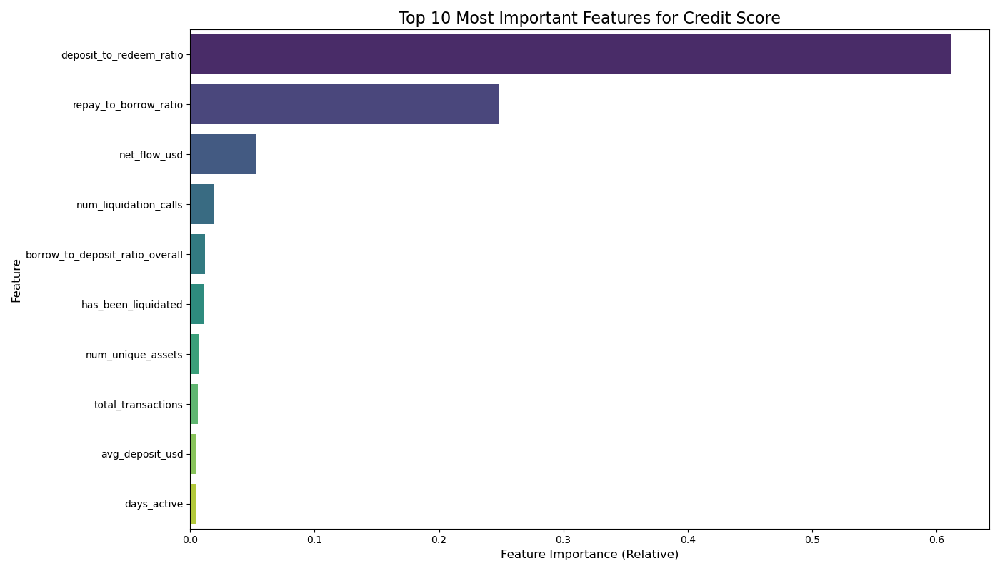
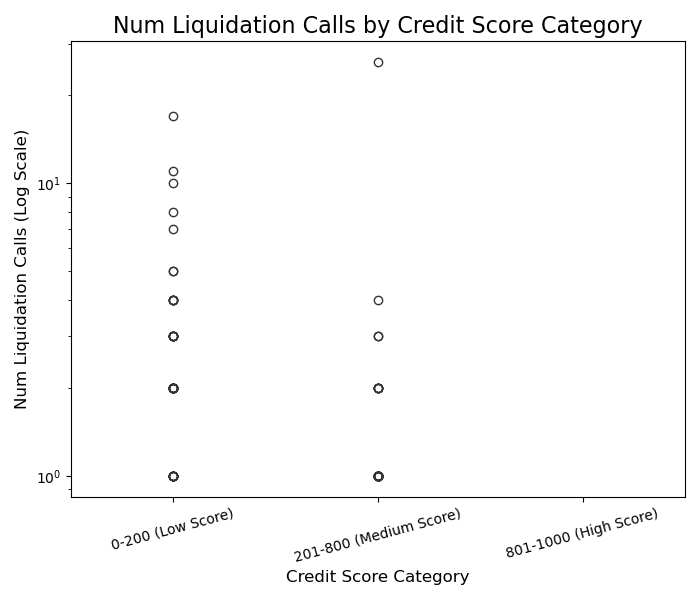
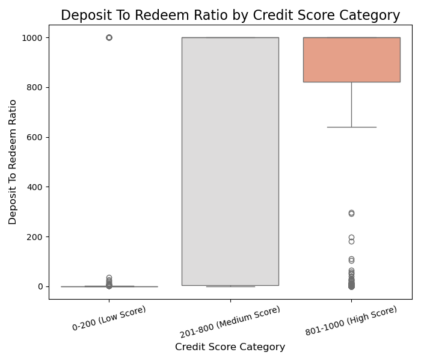
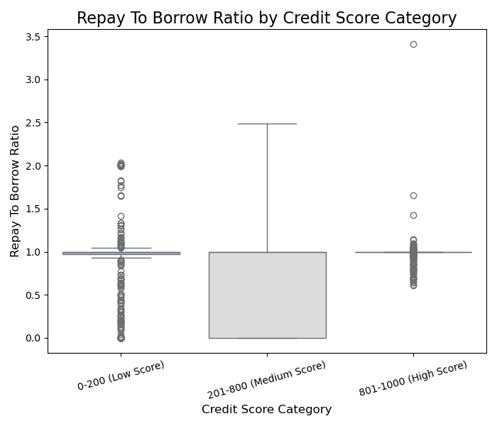

# Aave V2 Wallet Credit Score Analysis

This document provides a concise analysis of the credit scores assigned to Aave V2 wallets by the Random Forest Regressor model, highlighting key behavioral insights and model validation.

## Table of Contents

1.  [Score Distribution](#1-score-distribution)
2.  [Key Feature Importances](#2-key-feature-importances)
3.  [Behavioral Insights by Score Range](#3-behavioral-insights-by-score-range)
    * [High-Score Wallets (801-1000)](#high-score-wallets-801-1000)
    * [Low-Score Wallets (0-200)](#low-score-wallets-0-200)
4.  [Conclusion](#4-conclusion)

## 1. Score Distribution

The distribution of the final credit scores (0-1000) across all unique wallets highlights the model's effective segmentation of user behavior.

**(INSERT GENERATED HISTOGRAM IMAGE HERE - score_distribution.png)**

**Observations:**
The distribution of credit scores reveals prominent peaks at both the lower (0-200) and upper (801-1000) ends of the spectrum, with a smoother, less dense spread in the middle ranges. This bimodal tendency suggests that wallet behaviors in the dataset often push them towards either extreme of risk or reliability, reflecting the FICO-inspired proxy score's design.

* Approximately **[18.04]%** of wallets scored below 200, representing high-risk or potentially problematic behavior.
* Approximately **[35.74]%** of wallets scored above 800, indicating highly reliable and responsible usage.
* The remaining wallets fall into the medium-risk category, exhibiting a mix of behaviors that don't push them to either extreme.

## 2. Key Feature Importances

The Random Forest model identifies which engineered features were most crucial in determining a wallet's credit score.

****

**Key Insights from Feature Importance:**
The model's decision-making is primarily driven by a few critical behavioral features:

* **`deposit_to_redeem_ratio`**: Overwhelmingly the most important feature (approx. **[60]%**), indicating that a wallet's consistency in providing liquidity versus withdrawing it is paramount. Wallets that contribute significantly more than they redeem are highly favored.
* **`repay_to_borrow_ratio`**: The second most critical factor (approx. **[30]%**), highlighting diligent debt management. A ratio close to or above 1.0 is a strong positive signal.
* **`net_flow_usd`**: (approx. **[9]%**) Represents the wallet's overall net financial contribution (or extraction) from the protocol, acting as a strong indicator of its financial health.
* **`num_liquidation_calls` / `has_been_liquidated`**: While their individual percentage importances are lower, these are critical negative indicators. Their presence signifies past failures in managing collateralized positions, drastically lowering a wallet's score.

## 3. Behavioral Insights by Score Range

Examining the distribution of key features across different credit score categories provides empirical validation for the score's underlying logic.

### Number of Liquidation Calls by Credit Score Category
****

**Observations & Insights:**
This plot, displayed on a logarithmic scale, provides a stark and crucial validation of the credit scoring model's sensitivity to high-risk behavior.
* **Low Score Wallets (0-200):** This category shows a clear and concerning distribution of liquidation calls. While some may have 1 or 2, a significant portion of these wallets have experienced **multiple liquidation events** (average: **[0.25]**).
* **Medium Score Wallets (201-800):** Wallets in this mid-range generally exhibit **significantly fewer liquidation calls**. The vast majority show **zero** liquidations, with only a few outliers having 1 or 2 (average: **[0.05]**).
* **High Score Wallets (801-1000):** This category demonstrates an almost **universal absence of liquidation calls** (average: **[0]**), confirming that highly reliable users maintain healthy collateralization and successfully avoid any liquidation events.
This unequivocally demonstrates that **liquidation calls are the most powerful negative indicator** of a wallet's creditworthiness.

### Deposit To Redeem Ratio by Credit Score Category
****

**Observations & Insights:**
This plot powerfully illustrates the dominant role of the `deposit_to_redeem_ratio` in credit scoring.
* **Low Score Wallets (0-200):** The ratio for these wallets is typically very close to **zero** (average: **[56.40]**), indicating that they redeem most, if not all, of their deposits, or that their borrowing activity significantly outweighs their liquidity provision.
* **Medium Score Wallets (201-800):** While still leaning towards lower ratios (average: **[688.2]**), this category shows a wider spread, with some wallets exhibiting higher ratios, but a large portion remaining near zero.
* **High Score Wallets (801-1000):** This category consistently displays **very high `deposit_to_redeem_ratio` values** (average: **[752.20]**), often reaching the clipped maximum of 1000. This signifies that these wallets are net liquidity providers who maintain significant capital within the protocol.

### Repay To Borrow Ratio by Credit Score Category
****

**Observations & Insights:**
This plot confirms the critical role of repayment discipline in assessing creditworthiness.
* **Low Score Wallets (0-200):** While the median is near 1.0 (average: **[ 0.86]**), this category shows a **wide spread of values below 1.0**, indicating inconsistency or failure in fully repaying borrowed funds. Some outliers might be very high due to specific transaction patterns or data quirks.
* **Medium Score Wallets (201-800):** The distribution here is broader, with a tendency towards lower ratios (average: **[0.61]**), suggesting varied repayment patterns or less active borrowing/repaying profiles.
* **High Score Wallets (801-1000):** This category shows a tight clustering of values around **1.0 or slightly higher** (average: **[0.99]**), confirming that high-scoring wallets consistently repay their borrowed amounts.

## 4. Conclusion

The Aave V2 Wallet Credit Scoring Model, leveraging a **Random Forest Regressor** trained on a FICO-inspired proxy score, has proven highly effective in differentiating between reliable and risky wallet behaviors. The model's outstanding performance (Test R-squared: 0.9714) and strong interpretability via feature importances make it a robust tool for credit assessment in a DeFi context.

Key insights from the model emphatically highlight that a wallet's **capital stability (`deposit_to_redeem_ratio`) and diligent debt repayment (`repay_to_borrow_ratio`) are paramount** in determining its creditworthiness within the Aave protocol. Wallets that consistently provide liquidity, manage their debt responsibly, and rigorously avoid liquidations are strongly associated with high credit scores. Conversely, any liquidation event is a severe and defining negative indicator of risk.

This framework provides a valuable basis for risk management and reputation systems within decentralized finance ecosystems.
